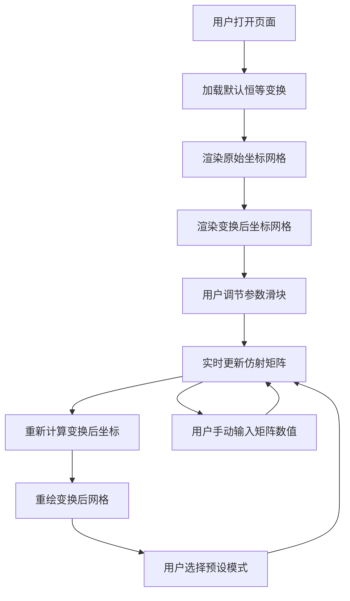

## 1. 产品概述

一个面向学术研究与教学的交互式可视化网站，直观展示卷积神经网络中仿射变换（Affine Transformation）对采样坐标的影响。用户可通过调节仿射变换矩阵参数，实时观察卷积核采样点在二维平面上的几何变形，理解空间变换与卷积操作之间的关系。

- 核心目标：将抽象的仿射变换数学概念转化为直观的坐标级可视化，帮助研究人员和学生理解卷积中的空间变换机制
- 目标用户：计算机视觉研究者、深度学习学习者、数学爱好者

---

## 2. 核心功能

### 2.1 用户角色

无需登录，所有访问者均为浏览用户，可直接操作所有可视化功能。

### 2.2 功能模块

1. **仿射变换控制面板**：提供仿射矩阵 6 个参数的滑块/输入控件，支持旋转、缩放、剪切、平移的独立或组合调节

2. **双视图坐标可视化**：
   - 原始采样网格视图：展示标准卷积核的规则采样点分布
   - 变换后采样网格视图：展示经仿射变换后的变形采样点分布
   - 叠加对比视图：将原始与变换后的网格叠加显示，直观呈现坐标映射关系

3. **矩阵实时显示**：动态展示当前 3×3 仿射变换矩阵的数值

4. **预设变换模式**：提供若干预设的仿射变换组合（恒等变换、旋转、缩放、剪切、通用仿射），便于快速切换

---

### 2.3 页面详情

| 页面名称 | 模块名称 | 功能描述 |
|---------|---------|---------|
| 主页 | 标题区 | 显示项目标题与简要说明 |
| 主页 | 双视图画布 | 左右并列或叠加显示原始坐标网格与变换后坐标网格，Canvas/SVG 渲染 |
| 主页 | 矩阵数值面板 | 实时显示 3×3 仿射矩阵各元素数值，支持手动输入 |
| 主页 | 参数调节面板 | 6 个滑块分别控制旋转角度、x/y 缩放、x/y 剪切、x/y 平移 |
| 主页 | 预设面板 | 一键切换常用仿射变换预设 |
| 主页 | 卷积核采样示意 | 在坐标网格上以圆点标记卷积核的各采样位置 |

---

## 3. 核心流程

---

## 4. 用户界面设计

### 4.1 设计风格

- **整体风格**：科学研究风格 — 简洁、精确、去装饰化，以数据可视化为中心
- **主色调**：深色背景 (#0d1117) 搭配青蓝色系强调色 (#58a6ff, #3fb950)，类似学术论文图表风格
- **次要色**：暖橙色 (#f0883e) 用于标注变换后的元素，与原始青色形成对比
- **字体**：标题使用 "IBM Plex Serif"（衬线体，学术感），正文使用 "IBM Plex Mono"（等宽字体，数据感）
- **布局**：左侧控制面板（约 30% 宽度）+ 右侧双视图画布（约 70% 宽度）的经典研究工具布局
- **按钮风格**：扁平化、细边框、悬停时微亮
- **图标风格**：线性图标，lucide-react 提供

### 4.2 页面设计概览

| 页面名称 | 模块名称 | UI 元素 |
|---------|---------|--------|
| 主页 | 标题区 | 深色背景上的浅色标题，副标题为灰色小字，底部细分割线 |
| 主页 | 双视图画布 | 两个并排的 Canvas 面板，分别标注"原始网格"和"变换网格"，青色坐标轴、橙色变换标记 |
| 主页 | 矩阵数值面板 | 3×3 矩阵以网格形式展示，可编辑输入框，数值实时同步 |
| 主页 | 参数调节面板 | 垂直排列的滑块组，每个滑块带有标签、当前数值显示、范围标注 |
| 主页 | 预设面板 | 水平排列的胶囊形按钮组，点击切换预设变换 |

### 4.3 响应式设计

桌面端优先，左侧控制面板 + 右侧画布布局。移动端时控制面板移至顶部折叠抽屉，画布上下堆叠。

---

### 4.4 Canvas 可视化要素

- 坐标系：以画布中心为原点，x 轴向右、y 轴向上（数学坐标约定）
- 网格线：浅色虚线，间距均匀
- 原始采样点：青色圆点，带有编号标注
- 变换后采样点：橙色圆点，带有对应编号标注
- 连接线：从原始点到变换点的虚线箭头，展示映射关系
- 卷积核范围：半透明矩形框标记卷积核的采样区域