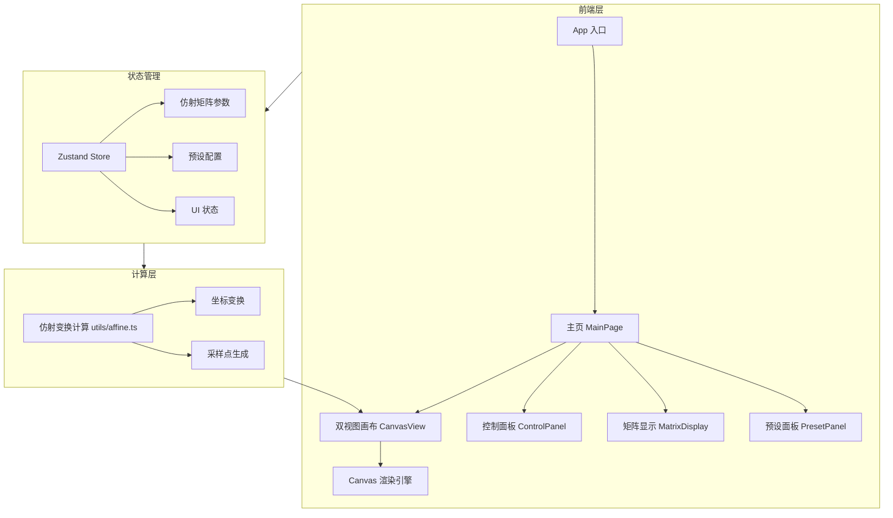

## 1. 架构设计



---

## 2. 技术选型

- **前端框架**：React@18 + TypeScript
- **样式方案**：Tailwind CSS@3
- **状态管理**：Zustand
- **图标库**：lucide-react
- **构建工具**：Vite
- **初始化模板**：react-ts
- **后端**：无（纯前端项目，所有计算在浏览器端完成）
- **Canvas 渲染**：原生 HTML5 Canvas API

---

## 3. 路由定义

| 路由 | 用途 |
|------|------|
| / | 主页，包含完整的仿射变换可视化交互界面 |

---

## 4. 组件树

```
App
└── MainPage
    ├── Header（标题栏）
    ├── ControlPanel（左侧控制面板）
    │   ├── ParamSlider × 6（6 个参数滑块）
    │   ├── MatrixDisplay（3×3 矩阵显示/编辑）
    │   └── PresetPanel（预设按钮组）
    └── CanvasView（右侧双视图画布）
        ├── OriginalCanvas（原始网格画布）
        └── TransformedCanvas（变换后网格画布）
```

---

## 5. 数据模型

### 5.1 仿射变换参数

```typescript
interface AffineParams {
  rotation: number;    // 旋转角度（弧度），范围 [-π, π]
  scaleX: number;      // X 轴缩放，范围 [0.1, 5]
  scaleY: number;      // Y 轴缩放，范围 [0.1, 5]
  shearX: number;      // X 轴剪切，范围 [-2, 2]
  shearY: number;      // Y 轴剪切，范围 [-2, 2]
  translateX: number;  // X 轴平移（像素），范围 [-200, 200]
  translateY: number;  // Y 轴平移（像素），范围 [-200, 200]
}

interface AffineMatrix {
  a: number;  // m11
  b: number;  // m12
  c: number;  // m13 (tx)
  d: number;  // m21
  e: number;  // m22
  f: number;  // m23 (ty)
}
```

### 5.2 采样点

```typescript
interface SamplePoint {
  id: number;
  x: number;
  y: number;
  label: string;
}

interface TransformedPoint {
  id: number;
  originalX: number;
  originalY: number;
  transformedX: number;
  transformedY: number;
}
```

### 5.3 Zustand Store

```typescript
interface AppState {
  params: AffineParams;
  matrix: AffineMatrix;
  kernelSize: number;      // 卷积核大小（如 3, 5, 7）
  activePreset: string;
  setParam: (key: keyof AffineParams, value: number) => void;
  setMatrixValue: (row: number, col: number, value: number) => void;
  setKernelSize: (size: number) => void;
  applyPreset: (preset: string) => void;
  recomputeMatrix: () => void;
}
```

---

## 6. 预设配置

```typescript
const presets: Record<string, AffineParams> = {
  identity:   { rotation: 0, scaleX: 1, scaleY: 1, shearX: 0, shearY: 0, translateX: 0, translateY: 0 },
  rotate45:   { rotation: Math.PI/4, scaleX: 1, scaleY: 1, shearX: 0, shearY: 0, translateX: 0, translateY: 0 },
  scaleUp:    { rotation: 0, scaleX: 1.5, scaleY: 1.5, shearX: 0, shearY: 0, translateX: 0, translateY: 0 },
  shear:      { rotation: 0, scaleX: 1, scaleY: 1, shearX: 0.5, shearY: 0, translateX: 0, translateY: 0 },
  translate:  { rotation: 0, scaleX: 1, scaleY: 1, shearX: 0, shearY: 0, translateX: 60, translateY: 40 },
  combined:   { rotation: Math.PI/6, scaleX: 1.3, scaleY: 0.8, shearX: 0.3, shearY: 0, translateX: 30, translateY: -20 },
};
```

---

## 7. 无后端架构说明

本项目为纯前端单页应用，所有计算（仿射变换、坐标映射）均在浏览器端通过 TypeScript 完成，无需后端服务或数据库。